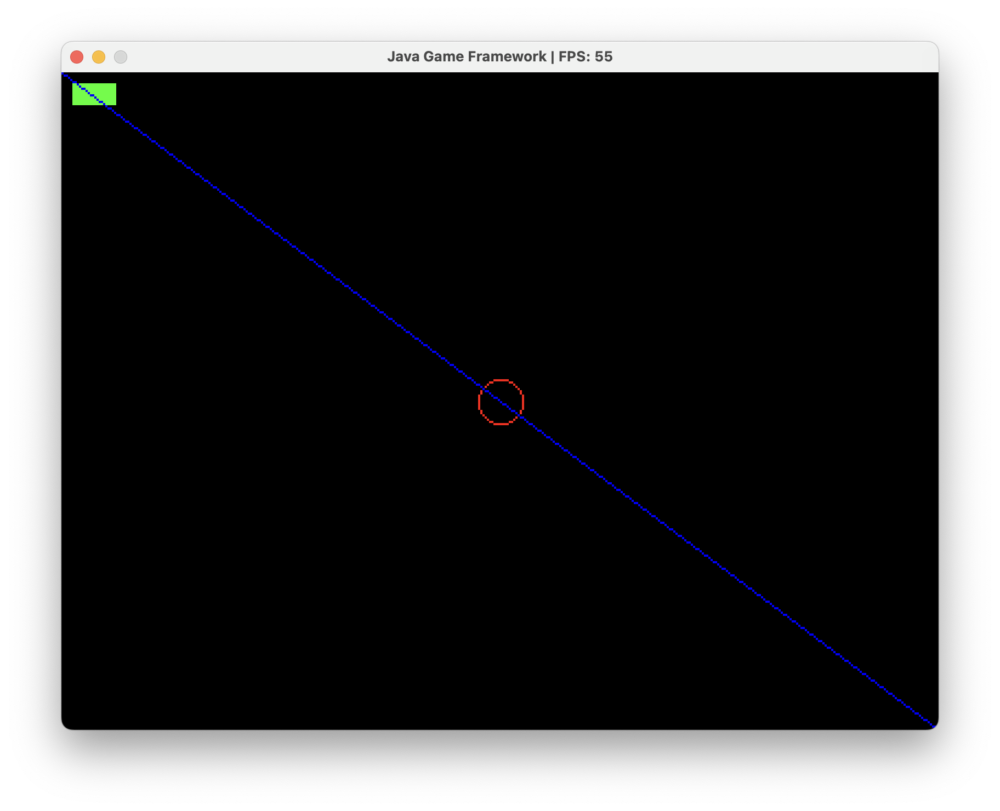

# Java Game Framework

A lightweight 2D game framework built in **Java** with real-time input handling and pixel-perfect rendering.

## Features

- **Keyboard & Mouse Input**: Real-time input handling.
- **Dynamic FPS Counter**: Displayed in the window title.
- **Custom Rendering**: Pixel-level drawing with resize support.

## Controls

- **`R`**: Draw a green rectangle.
- **`C`**: Draw a red circle.
- **`L`**: Draw a blue line.
- **`Esc`**: Quit the program.
